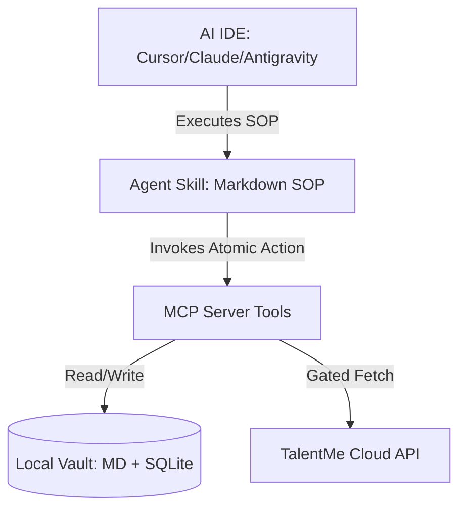

# TalentMe MCP - Developer & User Documentation

Welcome to the TalentMe Model Context Protocol (MCP) server documentation. This directory contains detailed specifications of all MCP Tools and Agent Skills.

---

## 🗺️ Architectural Overview

TalentMe operates on a **tri-partite architecture** designed to separate deterministic data access from LLM reasoning:

1.  **Local Vault (Obsidian + SQLite)**: The single source of truth for the user's career memory. Notes are in Markdown, and mastery stats are tracked in a `memory.db` SQLite database.
2.  **Model Context Protocol (MCP) Server**: Exposes atomic, secure Python primitives (`@mcp.tool()`) to the IDE.
3.  **Agent Skills**: System prompts (SOPs) injected into the AI's context. They tell the AI *how* and *when* to execute MCP tools.

---

## 🛠️ MCP Tools (Atomic Primitives)

TalentMe MCP registers a suite of tools for the AI assistant. These are grouped into logical domains:

### 1. Infrastructure & System
*   [list_agent_skills](en/tools/list_agent_skills.md): Lists cloud skills available under the user's subscription.
*   [read_agent_skill_instruction](en/tools/read_agent_skill_instruction.md): Retrieves the system instructions for a specific skill.
*   [check_user_auth_status](en/tools/check_user_auth_status.md): Verifies subscription tiers and license keys.
*   [get_session_context](en/tools/get_session_context.md): Returns current context metadata for the active AI session.

### 2. Dual-Source Search & Study
*   [search](en/tools/search.md): Parallel hybrid search across the local wiki and the cloud knowledge base.
*   [learn](en/tools/learn.md): Fetches verified educational concepts from the cloud for deep learning.
*   [assess](en/tools/assess.md): Fetches interactive assessment questions to evaluate domain knowledge.

### 3. Local Vault Management
*   [create_wiki_page](en/tools/create_wiki_page.md): Generates a new Markdown note in the local workspace.
*   [read_wiki_page](en/tools/read_wiki_page.md): Reads the content of an existing local Markdown file.
*   [update_wiki_page](en/tools/update_wiki_page.md): Append or overwrite contents in a local wiki page.
*   [list_local_wiki_pages](en/tools/list_local_wiki_pages.md): Scans and lists files under the configured memory categories.
*   [get_user_memory_summary](en/tools/get_user_memory_summary.md): Extracts a summary profile of the user's learning status.
*   [log_learning_progress](en/tools/log_learning_progress.md): Records practice results and updates mastery scores in `memory.db`.

### 4. Workflow Orchestration
*   [guide](en/tools/guide.md): Recommends the daily study priorities based on recent activity.
*   [review](en/tools/review.md): Pulls decayed knowledge points from the database using spaced repetition.
*   [status](en/tools/status.md): Aggregates mastery records to calculate readiness metrics and generates a skills radar plot.
*   [manage_interview](en/tools/manage_interview.md): Updates interview pipeline status and event timelines.
*   [import_expert_feedback](en/tools/import_expert_feedback.md): Merges external expert feedback into the local DB.
*   [rebuild_wiki_graph](en/tools/rebuild_wiki_graph.md): Updates local backlinks and double-checks SQLite mapping integrity.

---

## 🤖 Agent Skills (Steering Instructions)

Skills are orchestration prompts that guide the AI to handle complex loops. They are stored in `.skills/` (or synced from the cloud):

*   **`tm-guide`**: Directs the daily review and learning workflows.
*   **`tm-assess`**: Orchestrates interactive quizzes and grades user responses.
*   **`tm-mock`**: Initiates a strict stress mock-interview (Stress Interviewer role) and prevents the AI from giving hints prematurely.
*   **`tm-plan`**: Generates a 14-day sprint study roadmap based on assessment results.
*   **`tm-prep`**: Builds target company prediction guides (`PREP.md`) using recent cloud面经 (interview experience logs).
*   **`tm-debrief` & `tm-summary`**: Guides post-interview logs and distills lessons learned.
*   **`tm-resume`**: Dynamically adjusts resume bullet points based on the user's current mastery levels.
*   **`tm-cross-linker`**: Scans the vault to connect related concepts with Wikilinks (`[[link]]`).
*   **`tm-contradiction`**: Identifies logical conflicts between new notes and older files.
*   **`tm-merge`**: Intelligently updates existing notes with incoming study logs instead of duplicating files.

---

## 🌍 Language Versions

*   [English Documentation](README.md) (This page)
*   [中文版文档 (Chinese Version)](README_zh.md)
