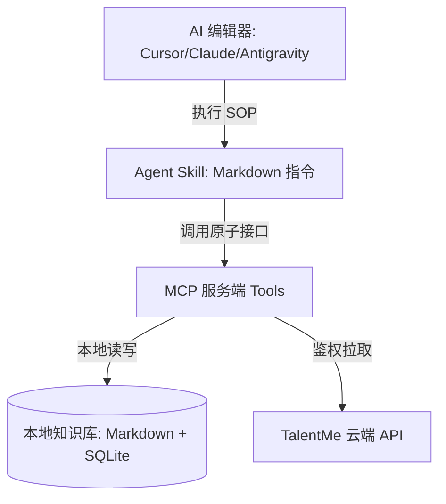

# TalentMe MCP - 开发者与用户文档

欢迎使用 TalentMe Model Context Protocol (MCP) 服务端文档。本目录包含所有 MCP Tools（原子接口）与 Agent Skills（智能指令）的详细规范。

---

## 🗺️ 架构设计全景

TalentMe 采用**三位一体的解耦架构**，将确定性的数据读写与大模型的推理决策严格分离：

1.  **本地知识库 (Obsidian + SQLite)**：用户职业数据的唯一真实水源。笔记以 Markdown 格式留存，熟练度分数由 `memory.db` 中的 SQLite 数据库统一管理。
2.  **MCP 服务端**：向 AI 编辑器注册一组安全的 Python 原子 API (`@mcp.tool()`)。
3.  **Agent Skills**：注入大模型 Context 的工作流指令（SOP）。指导大模型**在何种时机、以何种逻辑**调用 MCP 接口。

---

## 🛠️ MCP Tools (原子接口)

TalentMe MCP 服务端主要向 AI 助手提供以下四大类接口：

### 1. 基础架构与鉴权 (Infrastructure)
*   [list_agent_skills](zh/tools/list_agent_skills.md)：列出用户当前订阅级别下所有可用的云端技能。
*   [read_agent_skill_instruction](zh/tools/read_agent_skill_instruction.md)：获取指定技能的系统 Prompt 提示词。
*   [check_user_auth_status](zh/tools/check_user_auth_status.md)：校验用户订阅等级与 License 激活状态。
*   [get_session_context](zh/tools/get_session_context.md)：获取当前 AI 对话的上下文元数据。

### 2. 双源检索与精读 (Search & Learn)
*   [search](zh/tools/search.md)：在本地 Wiki 目录和云端知识库中进行并行的混合检索。
*   [learn](zh/tools/learn.md)：从云端拉取经过专家校准的 ML 知识要点，开始伴学精读。
*   [assess](zh/tools/assess.md)：获取定级测试题目并进行实战评测。

### 3. 本地存储管理 (Local Vault)
*   [create_wiki_page](zh/tools/create_wiki_page.md)：在本地工作区创建一张新的 Markdown 知识卡片。
*   [read_wiki_page](zh/tools/read_wiki_page.md)：读取已有的本地 Markdown 笔记内容。
*   [update_wiki_page](zh/tools/update_wiki_page.md)：对已有本地笔记执行追加或覆盖写入。
*   [list_local_wiki_pages](zh/tools/list_local_wiki_pages.md)：分类扫描并列出本地已存在的笔记。
*   [get_user_memory_summary](zh/tools/get_user_memory_summary.md)：快速提取用户当前的整体熟练度摘要。
*   [log_learning_progress](zh/tools/log_learning_progress.md)：更新本地 `memory.db` 数据库中的知识点熟练度（Mastery）。

### 4. 学习流调度 (Orchestration)
*   [guide](zh/tools/guide.md)：拉取今日待复习盲区，提供每日学习向导。
*   [review](zh/tools/review.md)：根据艾宾浩斯记忆曲线计算并拉取需要复习的卡片。
*   [status](zh/tools/status.md)：聚合熟练度数据并生成就绪度评估报告及技能雷达图。
*   [manage_interview](zh/tools/manage_interview.md)：录入或修改面试时间线和录取阶段。
*   [import_expert_feedback](zh/tools/import_expert_feedback.md)：将外部导师的评分 JSON 自动回流至本地数据库。
*   [rebuild_wiki_graph](zh/tools/rebuild_wiki_graph.md)：重建双向链接并反向同步熟练度，防数据漂移。

---

## 🤖 Agent Skills (智能指令)

Agent Skills 是存于 `.skills/` 目录中的 Markdown 格式 SOP。用于教导大模型处理复杂交互：

*   **`tm-guide`**：总控向导。指引 AI 调用 review 还是 learn 开始学习。
*   **`tm-assess`**：定级交互。控制 Quiz 流程，并在结束后打分。
*   **`tm-mock`**：模拟面试。扮演冷酷严苛的 Bar Raiser，绝不提前透露答案，极限压测用户。
*   **`tm-plan`**：生成 14 天冲刺计划。
*   **`tm-prep`**：面试前瞻指导。根据目标公司面经生成预测题目清单 (`PREP.md`)。
*   **`tm-debrief` 与 `tm-summary`**：面试后复盘指导，总结错题归档。
*   **`tm-resume`**：简历优化。根据本地熟练度数据动态润色简历 bullet points。
*   **`tm-cross-linker`**：图谱织网。扫描并自动补全 Wiki 页面间的 `[[双链]]`。
*   **`tm-contradiction`**：静态防错。对比新学知识与本地已有知识，发现冲突时警报。
*   **`tm-merge`**：智能合并。导入笔记时判定是增量合并还是覆盖。

---

## 🌍 语言版本

*   [English Documentation (英文版)](README.md)
*   [中文文档](README_zh.md) (当前页面)
