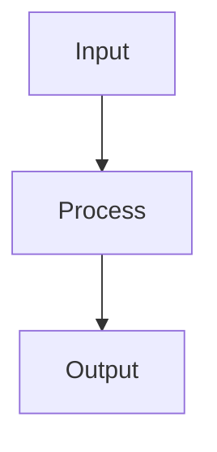

# {{TITLE}}

## 1. 🚀 TL;DR
- **What**: [One-sentence clear definition of the concept]
- **Why**: [Why was this invented? What critical pain point or limitation of previous methods does it solve?]

## 2. ⚙️ Core Mechanics & Math
### 2.1 Definitions & Formulas
[Write rigorous mathematical formulas and core mechanics here]
$$
\text{Formula} = \dots
$$

### 2.2 Core Workflow / Architecture
[Use Mermaid diagrams or describe the core execution flow if necessary]

## 3. ⚖️ Engineering Trade-offs
- **✅ Pros**: [List 2-3 core advantages]
- **❌ Cons**: [List 2-3 critical disadvantages or limitations]
- **💡 When to Use**: [Under what business/hardware constraints should this approach be prioritized?]
- **🖥️ System Impact**: [Specific impact on VRAM, training time, inference latency, and throughput]

## 4. 💬 Mock Interview Q&A
*Provide 5 to 10 high-quality mock interview questions ranging from basics to deep dives.*

### 📌 Q1: [Common question, e.g., comparison]
**🗣️ Candidate Response:**
> "When comparing A and B, the fundamental difference lies in..."

### 📌 Q2: [Deep dive / Follow-up question]
**🗣️ Candidate Response:**
> "That's a great point. On the surface... but under the hood..."

*(Continue up to Q5-Q10...)*

## 5. ⚠️ Common Pitfalls & Anti-patterns
- 🧨 **Interview Gotchas**: [Common misconceptions candidates have, e.g., forgetting a square in a formula, or confusing training vs. inference behavior]
- 💥 **Industry Pitfalls**: [Real-world deployment issues like OOMs, numerical instability, or distributed training bottlenecks]

---

## 🔗 Cross-References
<!-- NOTE FOR AGENT: 
     - ONLY wrap concepts in double brackets [[Wikilinks]] if they already exist locally in the workspace.
     - For concepts that do not exist locally yet, write them as plain text (e.g., Concept Name) to prevent broken links.
-->
- ⬅️ **Prerequisites**: Prerequisite_Concept_Name
- ↔️ **Comparisons**: Alternative_Concept_A, Alternative_Concept_B
- ➡️ **Next Steps / Advanced**: Advanced_Concept_Name
